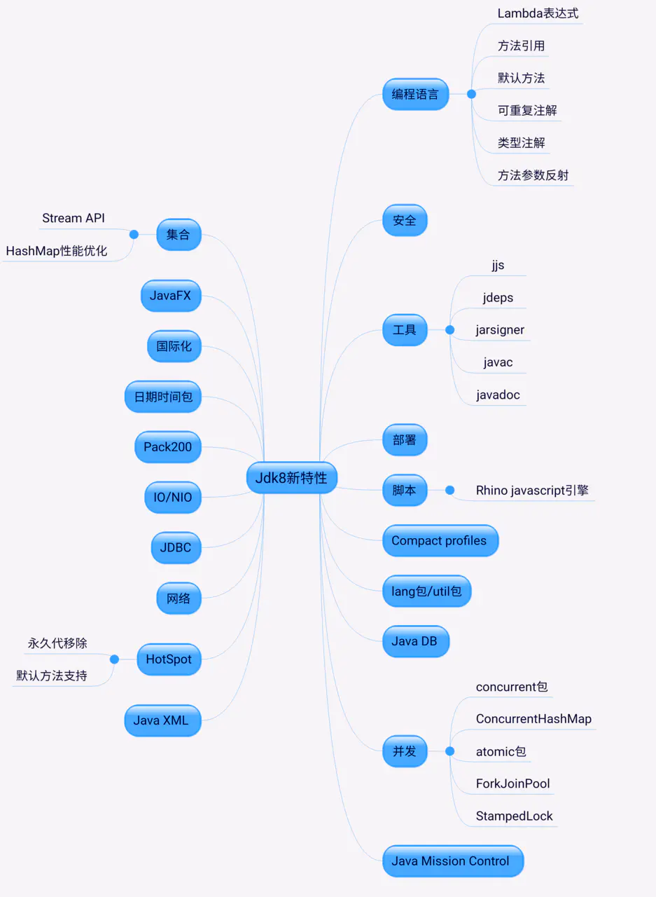

# Java基础结构

## jdk1.7和1.8的区别

1. 增加了stream特，主要基于fork-join框架构，可以在并行流和顺序流之间进行切换。
1. Hashmap性能优化。
1. 永久代移变成元空间。
1. lamda表达式。
1. 并发：LongAdder(AtomicLong 的并发进化版)
1. CompletableFuture。
1. StampedLock。
1. ConcurreentHashmap
1. fork-join框架的优化
   

[引用](https://juejin.im/post/6844904122169196552)

