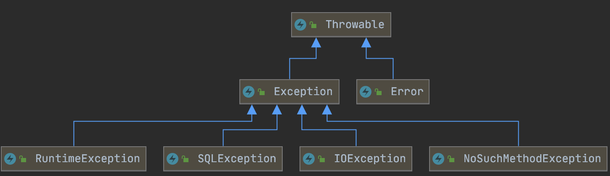

# 异常处理

## 当finally块具有return语句时会发生什么

返回的值将覆盖相应的try块返回的任何值。

## throw跟throws的区别

- throw，作用于方法内，用于主动抛出异常

- throws, 作用于方法声明上，声明该方法有可能会抛些某些异常

针对项目中，异常的处理方式，我们一般采用层层往上抛，最终通过异常处理机制统一处理（展示异常页面，或返回统一的json信息），自定义 异常一般继承RunntimeException，我们去看看Hibernate等框架，他们的异常体系都是最终继承自RunntimeException

## 罗列常见的5个非运行时异常

IOException

SQLException

FileNotFoundException

NoSuchFileException

NoSuchMethodException

## 罗列常见的5个运行时异常

此类异常，编译时没有提示做异常处理，因此通常此类异常的正确理解应该是“逻辑错误”

算数异常，

空指针，

类型转换异常，

数组越界，

NumberFormateException（数字格式异常，转换失败，比如“a12”就会转换失败）

## 请描述下Java的异常体系

异常体系如下：
  

Error是虚拟机内部错误

> 栈内存溢出错误：StackOverflowError(递归，递归层次太多或递归没有结束)
>
> 堆内存溢出错误：OutOfMemoryError(堆创建了很多对象)

Exception是我们编写的程序错误

> RuntimeException：也称为LogicException
>
> 为什么编译器不会要求你去try catch处理？
>
> 本质是逻辑错误，比如空指针异常，这种问题是编程逻辑不严谨造成的
>
> 应该通过完善我们的代码编程逻辑，来解决问题

非RuntimeException：

> 编译器会要求我们try catch或者throws处理
>
> 本质是客观因素造成的问题，比如FileNotFoundException
>
> 写了一个程序，自动阅卷，需要读取答案的路径（用户录入），用户可能录入是一个错误的路径，所以我们要提前预案，写好发生异常之后的处理方式，这也是java程序健壮性的一种体现
