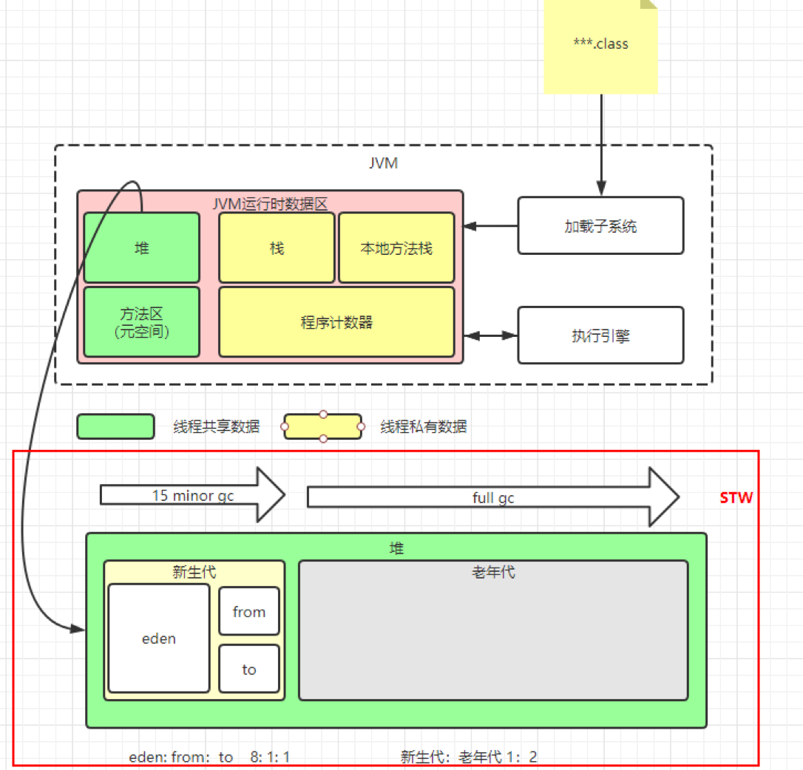

# Java虚拟机

## JVM堆内存模型

## OOM

原因：可使用内存太少；用的太多，用完没有释放（内存泄露，内存溢出）。
最常见的情况：OutOfMemoryError: Java heap space；OutOfMemoryError：MetaSpace；StackOverflowError ------> 不会抛OOM error，但也是比较常见的Java内存溢出。
排查手段：Dump分析。如果是内存溢出，调整-Xmx和-Xms。如果是内存泄露通过Jprofiler分析修复。
