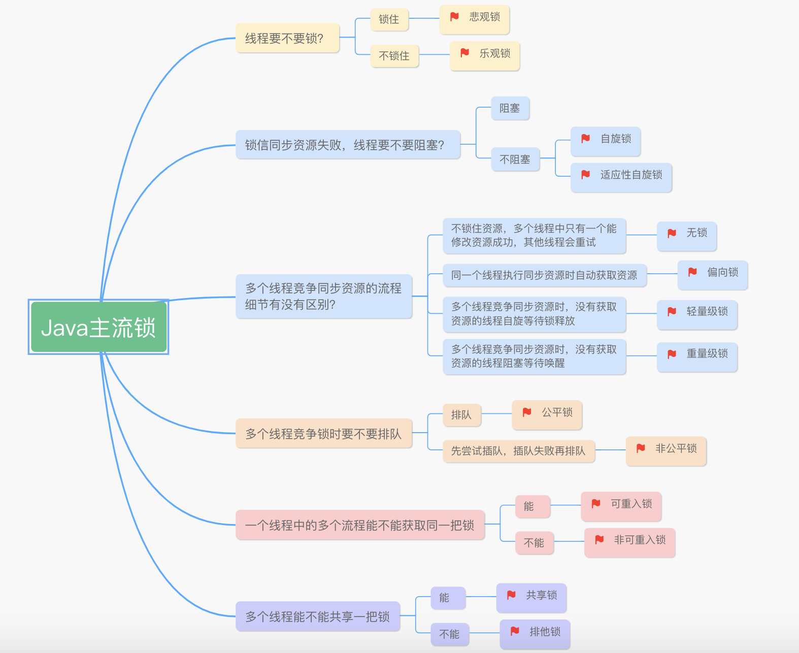

# 同步

## Java的锁有哪些

悲观锁，乐观锁；自旋锁，适应性自旋锁；无锁，偏向锁，轻级锁，重量级锁；公平锁，非公平锁；可重入锁，非可重入锁；共享锁，排他锁；闭锁等。
  

[Java主流锁原图](https://www.processon.com/mindmap/5f43286a5653bb57696cba##)  

[美团锁事](https://tech.meituan.com/2018/11/15/java-lock.html)

## synchronized与Lock的区别

1. 原始构成
    - synchronized是关键字属于JVM层面（ monitorenter， monitorexit）
    - Lock是具体类是API层的锁
2. 使用方法
    - synchronized不需要用户去手动释放锁，当synchronized代码执行完后系统会自动让线程释放对锁的占用
    - ReentrantLock则需要用户去手动释放锁，若没有主动释放锁，就可能导致出现死锁的现象。
        需要lock()各unlock()方法配合try/finally语句块来完成。
3. 等待是否可中断
    - synchronized不可中断，除非抛出异常或者正常运行完成
    - ReentrantLock可中断，
        1. 设置超时方法trylock(long timeout,TimeUnit unit)
        2. lockInterruptibly()放代码块中，调用interrput()方法中断
4. 加锁是否公平
    - synchronized非公平锁
    - ReentrantLock两者都可以，默认为非公平锁
5. 锁绑定多个条件Condition
    - synchronized没有
    - ReentrantLock用来实现分组唤醒的线程们，可以精确唤醒，而不是synchronized要么随机唤醒一个线程要么唤醒全部线程
