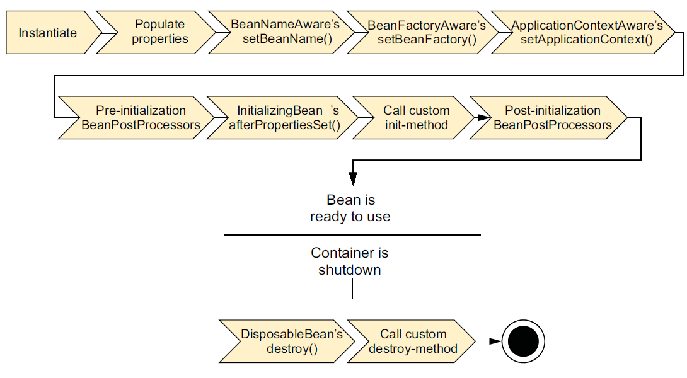
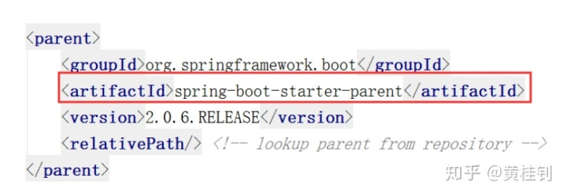
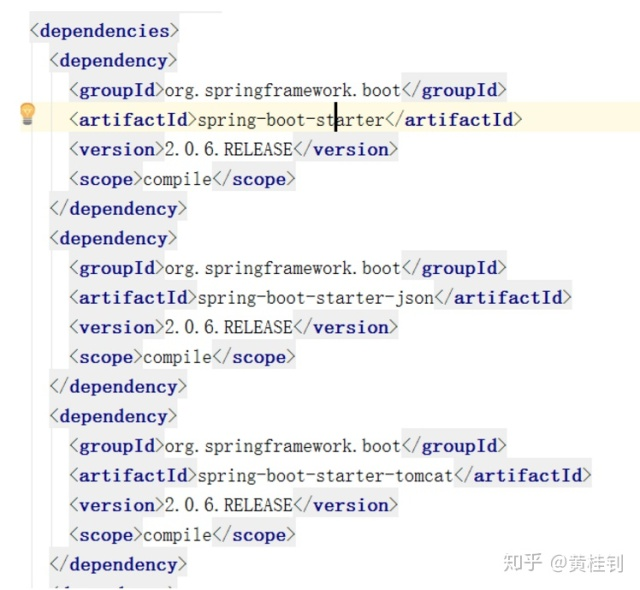
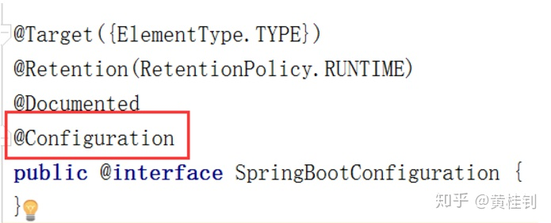
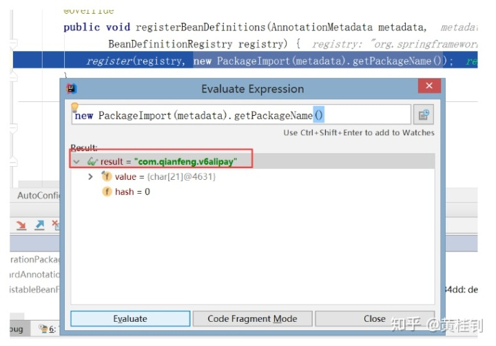

# Spring内核

## Spring bean生命周期

bean生成---销毁

bean定义（BeanDefinition）

1. scope
2. initMethod
3. byName byType
4. dependsOn
5. beanClass

实例化->填充属性->BeanNameAware绑定Name ID->BeanFactoryAware绑定Factory->ApplicationContextAware绑定上下文->
Bean后置处理器预初始化->InitializingBean的后属性设置->自定义初始化方法->Bean后置处理器的后初始化->
放到单例池待用->
DisposableBean的销毁方法->自定义销毁方法
  

## Bean创建的几种方式

1. @Bean
1. 配置器创建
1. BeanFactory.registerSingleton

## ApplicationContext与BeanFactory的区别

ApplicationContext扩展了BeanFactory的功能，也扩展了其他的比如环境，国际化等等功能。

## 拦截器和过滤器什么区别

Spring的拦截器与Servlet的过滤器Filter有很多相似之处，比如两者都是AOP编程思想的体现，都能实现权限检查、日志记录等，不同的是：

1. 使用范围不同：Filter是Servlet规范规定的，只能用于Web程序中，而拦截器既可以用于Web程序，也可以用于Application、Swing程序中
2. 规范不同：Filter是Servlet规范中定义的，是Servlet容器支持的。而拦截器是在Spring容器内的，是Spring框架支持的
3. 使用的资源不同：拦截器是一个Spring的组件，归Spring管理，配置在Spring文件中，因此能使用Spring里的任何资源、对象，例如Service对象、数据源、事务管理等，通过IoC注入到拦截器即可，而Filter则不能
4. 深度不同：Filter只在Servlet前后起作用。而拦截器能够深入到方法前后、异常抛出前后等，因此拦截器的使用具有更大的弹性。所以在Spring架构的程序中，要优先使用拦截器。
5. 实现原理不同：拦截器是基于动态代理来实现的，而过滤器是基于函数回调来实现的。
6. 作用域不同：拦截器只对Action起作用，过滤器可以对所有请求起作用。
7. 调用次序不同：在action的生命周期中，拦截器可以多次被调用，而过滤器只能在容器初始化时被调用一次。

## Spring怎样解决bean循环依赖的问题

bean后置处理器(BeanPostProccess，这里的后置指的是Bean生命周期的每个节点都有执行)解决的。构造器循环依赖直接运行失败，属性和方法循环依赖不会。

[引用](https://www.bilibili.com/video/BV1tx411o77Z?p=10)

## Spring中的AOP是怎么实现的

使用代理的方式实现。若是接口则使用jdk动态代理，若是类使用cglib。

## 为什么java动态代理必须是接口

因为jdk动态代理生成的类默认继承Proxy，Java是单继承方式。

## Spring和事务的关系

Spring和事务之间是管理关系。

## Spring提供三个接口供我们使用事务

TransactionDefinition：平台事务管理器，PlatformTranscationManager：事务定义（隔离级别，传播行为，超时，只读，回滚规则）, TransactionStatus：事务运行状态。

## 谈谈自定义注解

注解的内容很多，本次的面试题讲解主要是针对以下几个问题：

1. 注解是在编译期生效还是运行期生效？
2. 有没有在编译期生效的注解？
3. 编译期生效的注解和运行期生效的注解有什么区别？

我们的分析如下：

***首先***，第一个问题是给面试者挖坑，两者都存在，关键看注解的定义描述；

***其次***，第二个问题是有，比如我们JDK默认提供注解@Override。

我们观察其注解的定义如下

```java
@Target(ElementType.METHOD)
@Retention(RetentionPolicy.SOURCE)
public @interface Override {
}
```

上面的两个注解说明做下解释：

- @Target(ElementType.METHOD) ：表示该注解可以放到方法的定义上
- @Retention(RetentionPolicy.SOURCE) ： 表示该注解在编译期有效

那什么是编译期有效？

就好比我们说的@Override，它的作用就是在编译期间，检查我们重写的代码有没有符合语法规则，如果不符合就会通过红线报错，编译失败，而真正到运行期间就没有作用了

***最后***，说第三个问题。

就是运行期的注解有什么用，其实我们用过的很多框架，他们都会提供注解，这些都不是JDK提供的注解，我们统称为自定义注解。

比如Springweb提供的@RestController

我们观察其注解的定义说明如下：

```java
@Target(ElementType.TYPE)
@Retention(RetentionPolicy.RUNTIME)
@Documented
@Controller
@ResponseBody
public @interface RestController {
}
```

我们可以看到其关键点的描述为：

@Retention(RetentionPolicy.RUNTIME) ： 表示是运行期有效

为什么需要定义为运行期有效？

大家想想，我们创建Controller是不是在服务运行期间才正式对外提供服务的，而Spring容器需要去检查到底哪些Controller可以对外提供服务，那么以这个自定义注解为暗号，一看，咦，你小子有这个注解，行了，你就是可以对外提供服务的人，所以注解必须是在运行期间有效

## 谈谈SpringBoot的工作原理

对技术的探索，一切源于好奇心，保持好奇心，才能让人更年轻。

至今，我们已经有了很多创建SpringBoot项目的经验，比如我们要创建一个支持web开发的项目，我们只需要引入web-starter模块即可。

那么，SpringBoot为什么这么神奇？引入的依赖变少了，配置文件也不见了，但项目却可以正常运行。下面我们一起来探究这背后的逻辑：

1. 为什么依赖的依赖变少了？SpringBoot是如何管理这些依赖的？

    我们分两个点来看起

    1.1. 从pom文件出发

    首先，是有一个父工程的引用
      

    我们继续往里面跟踪，发现父工程又依赖于另一个父工程
      

    继续跟踪，发现这是一个pom工程，统一控制版本
      

    定义了一堆第三方jar包的版本
      

    ***结论***：

    所有我们使用了SpringBoot之后，由于***父工程有对版本的统一控制，所以大部分第三方包，我们无需关注版本***，个别没有纳入SpringBoot管理的，才需要设置版本号

    1.2. ***SpringBoot将所有的常见开发功能，分成了一个个场景启动器（starter）***，这样我们需要开发什么功能，就导入什么场景启动器依赖即可。

    比如，我们现在要开发web项目，所以我们导入了spring-boot-starter-web
      

    我们来跟踪看看，内部也复用一些starter
      

    还有Springweb和SpringMVC，这也就是为什么，我们就可以开发SpringWeb程序的原因
      

    ***结论***：

    大家会发现，***SpringBoot是通过定义各种各样的Starter来管理这些依赖的***。比如，我们需要开发web的功能，那么引入spring-boot-starter-web；比如，我们需要开发模板页的功能，那么引入spring-boot-starter-thymeleaf；我们需要整合redis，那么引入spring-boot-starter-data-redis；我们需要整合amqp，实现异步消息通信机制，那么引入spring-boot-starter-amqp等等。

2. 为什么我们不需要配置？

    我们来看看SpringBoot的启动类代码，除了一个关键的注解，其他都是普通的类和main方法定义
      

    那么，我们来观察下这个注解背后的东西，发现，这个注解是一个复合注解，包含了很多的信息
    

    其他注解都是一个注解的常规配置，所以关键看圈中的这两个

    我们来分析第一个关键注解：@SpringBootConfiguration

    我们可以看到，内部是包含了@Configuration，这是Spring定义配置类的注解

    而@Configuration实际上就是一个@Component，表示一个受Spring管理的组件
      

    结论：

    ***@SpringBootConfiguration这个注解只是更好区分这是SpringBoot的配置注解，本质还是用了Spring提供的@Configuration注解***

    我们再来探讨下一个注解：@EnableAutoConfiguration。
    这个注解的作用是告诉SpringBoot开启自动配置功能，这样就减少了我们的配置。那么具体是怎么实现自动配置的？我们先来观察这个注解背后的内容：
      

    所以，又到了分析其中的两个注解了。先来分析@AutoConfigurationPackage。观察其内部实现，内部是采用了@Import，来给容器导入一个Registrar组件
      

    所以，我们继续往下跟踪，来看Registrar内部是什么情况？
    

    我们可以跟踪源码看看这段是什么信息
      

    结论：

    通过源码跟踪，我们知道，程序运行到这里，会去加载启动类所在包下面的所有类。

    这就是为什么，默认情况下，我们要求定义的类，比如controller，service必须在启动类的同级目录或子级目录的原因。

    再来分析 ***@Import(AutoConfigurationImportSelector.class)***。

    这个的关键是来看AutoConfigurationImportSelector.class内部的细节。在这个类的内部，有一个关键的方法，我们可以调试来看看结果
      

    发现***默认加载了好多的自动配置类，这些自动配置类，会自动给我们加载每个场景所需的所有组件，并配置好这些组件，这样就省去了很多的配置***。
      
